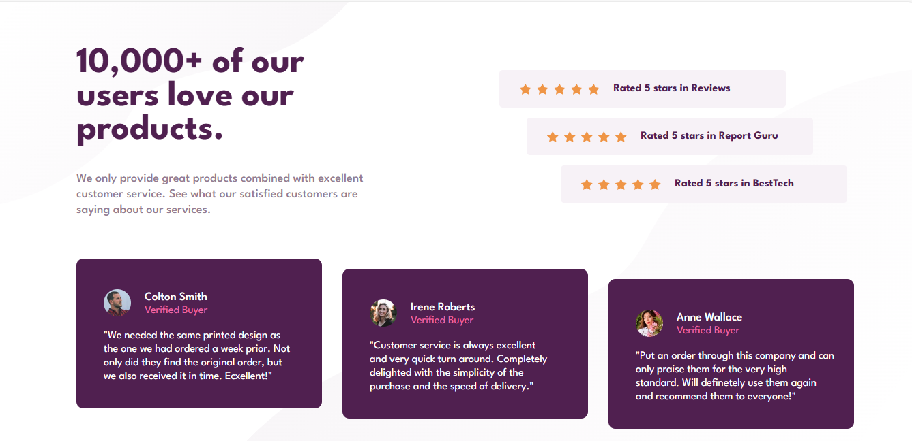

# Frontend Mentor - Social proof section solution

This is a solution to the [Social proof section challenge on Frontend Mentor](https://www.frontendmentor.io/challenges/social-proof-section-6e0qTv_bA). Frontend Mentor challenges help you improve your coding skills by building realistic projects. 

## Overview
 A responsive layout that highlights a product’s positive reviews and customer testimonials in a clean, modern, and user-friendly design.
It showcases the use of semantic HTML, custom font integration, Flexbox layout techniques, and responsive design using media queries. The final result adapts smoothly across desktop and mobile devices, maintaining visual consistency and clarity.

### The challenge
Users should be able to:
- View the optimal layout for the section depending on their device's screen size

### Screenshot

### Live Site Url
https://echo-script0.github.io/Social-proof-section/

### Built with

- Semantic HTML5 markup
- CSS custom properties
- Flexbox
- CSS Grid
- Mobile-first workflow

## Author
- Aisha Adeyemo
- Frontend Mentor - (https://www.frontendmentor.io/profile/echo-script0)
